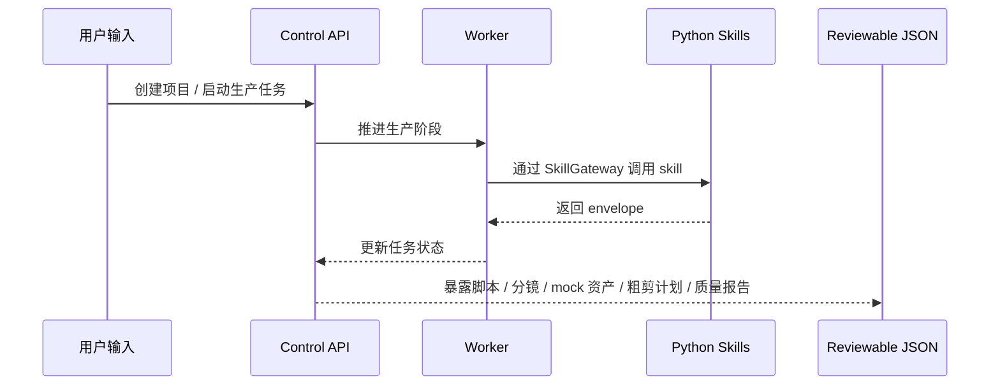

# MiLuStudio

MiLuStudio 是一个 Windows 原生 AI 漫剧生产 Agent 项目。项目面向普通创作者，目标是让用户输入中文故事、小说片段或创作要求后，通过可审阅的生产链路生成脚本、角色设定、画风、分镜、图片提示词、mock 图片资产、视频提示词、mock 视频片段、配音任务、SRT-ready 字幕、粗剪计划、质量报告和最终导出包。

当前仓库采用前后端、Worker、Python Production Skills 和桌面端分离的工程结构。Stage 15 已把 Electron 桌面宿主作为独立交付壳接入：桌面端只负责承载 Web UI、启动本地 Control API / Worker、注入 Control API base URL、展示 preflight 和生成 Windows 安装包，不绑定数据库 schema、migration 或业务文件系统。Stage 16 已补齐本地 deterministic 账号注册、登录、会话、设备绑定和许可证授权系统，正式授权语义统一位于 Control API / Auth & Licensing adapter。

> 说明：当前项目处于 MVP 工程搭建阶段。Stage 0 到 Stage 16 已完成，已可通过 Electron + electron-builder + NSIS 生成 Windows 桌面安装包，并在应用内通过 Control API 完成登录、注册、测试激活码、设备绑定和许可证状态校验。真实模型 provider、真实图片 / 视频 / 音频生成、真实媒体质检和 FFmpeg 成片尚未接入。现有 Skills 只输出可审阅 JSON envelope，不生成真实媒体文件。

## 项目功能

- 对中文故事或小说片段做结构化解析。
- 生成短剧改编大纲、集脚本、旁白、对白和字幕候选。
- 生成角色设定、角色音色规划和画风规则。
- 生成可审阅分镜，包含镜头时长、画面描述、角色和镜头语言。
- 生成图像提示词和 mock 图片资产结构。
- 生成视频提示词和 mock 视频片段结构。
- 生成配音任务、SRT-ready 字幕结构和粗剪 timeline / render plan。
- 生成质量问题报告、严重级别、可自动重试项和人工确认 checkpoint。
- 通过 Control API 暴露项目、生产任务、暂停、恢复、重试、checkpoint 和 SSE 进度边界。
- 已通过 Control API / Auth & Licensing adapter 管理账号、会话、设备绑定、许可证状态和授权错误。
- 已为 PostgreSQL 持久化、真实媒体质检 adapter、真实 provider adapter、桌面安装包和云端授权 adapter 预留清晰边界。

## 技术栈

| 模块 | 技术 |
| --- | --- |
| 前端 | React、Vite、TypeScript、CSS、lucide-react |
| Control API | .NET 8、ASP.NET Core、Minimal API |
| 应用层 | ProjectService、ProductionJobService、TaskQueueService、AuthLicensingService |
| Worker | .NET BackgroundService 边界 |
| 当前存储 | PostgreSQL 默认，InMemoryControlPlaneStore 作为快速 smoke 备选 |
| PostgreSQL | EF Core DbContext、Npgsql、SQL migration runner、preflight |
| Production Skills | Python、统一 CLI、SkillGateway、JSON envelope |
| 桌面端 | Electron、electron-builder、NSIS assisted installer、自定义 `installer.nsh` |
| 开发环境 | Windows、PowerShell、D 盘封闭依赖和缓存 |

## 系统架构


架构原则：

- UI 只通过 Control API 和 DTO 通信。
- UI 不直接访问数据库、文件系统、Python 脚本、模型 SDK 或 FFmpeg。
- Python Skills 只负责内部生产能力，输入 JSON，输出 JSON envelope。
- 数据库属于后端基础设施，先在 Control API / Worker / Infrastructure 内完成。
- Electron 只做桌面宿主、安装器和本地进程管理，不定义数据库表，不执行 migrations。

## 目录结构

```text
MiLuStudio/
├── apps/
│   ├── web/                         # React + Vite 前端壳
│   └── desktop/                     # Electron 桌面宿主和 NSIS 打包配置
├── backend/
│   ├── control-plane/               # .NET API / Application / Domain / Infrastructure / Worker
│   └── sidecars/
│       └── python-skills/           # Python Production Skills Runtime
├── docs/                            # 总控规划、阶段计划、任务记录、交接记录
├── scripts/
│   └── windows/                     # Windows / D 盘环境约束脚本
├── README.md
└── .gitignore
```

## 核心生产链路

当前 Python Skills 已打通以下 deterministic envelope 链路，Stage 12 已为这些输出补齐后端持久化写回边界：

```text
story_intake
  -> plot_adaptation
  -> episode_writer
  -> character_bible
  -> style_bible
  -> storyboard_director
  -> image_prompt_builder
  -> image_generation
  -> video_prompt_builder
  -> video_generation
  -> voice_casting
  -> subtitle_generator
  -> auto_editor
  -> quality_checker
  -> export_packager
```



## 数据库与持久化说明

Stage 13 起，默认开发运行切到 PostgreSQL：

- 本机 PostgreSQL 18 Windows 服务
- 数据库名：`milu`
- 用户名：`root`
- 密码：`root`
- 连接串：`Host=127.0.0.1;Port=5432;Database=milu;Username=root;Password=root`

PostgreSQL adapter 已在 Stage 12 接入，Stage 13 已将 PostgreSQL 作为默认业务事实来源。仓库中已有 SQL migration：

```text
backend/control-plane/db/migrations/001_initial_control_plane.sql
backend/control-plane/db/migrations/002_stage12_postgresql_claiming.sql
backend/control-plane/db/migrations/003_stage14_checkpoint_notes.sql
backend/control-plane/db/migrations/004_stage16_auth_licensing.sql
```

本机初始化和迁移：
```powershell
powershell -ExecutionPolicy Bypass -File D:\code\MiLuStudio\scripts\windows\Initialize-MiLuStudioPostgreSql.ps1

. D:\code\MiLuStudio\scripts\windows\Set-MiLuStudioEnv.ps1
D:\soft\program\dotnet\dotnet.exe build D:\code\MiLuStudio\backend\control-plane\MiLuStudio.ControlPlane.sln --no-restore -p:OutputPath=D:\code\MiLuStudio\.tmp\stage14-build\

$env:ASPNETCORE_URLS = "http://127.0.0.1:5368"
$env:ASPNETCORE_ENVIRONMENT = "Development"
D:\soft\program\dotnet\dotnet.exe D:\code\MiLuStudio\.tmp\stage14-build\MiLuStudio.Api.dll

Invoke-RestMethod -Method Post http://127.0.0.1:5368/api/system/migrations/apply
Invoke-RestMethod http://127.0.0.1:5368/api/system/preflight
```

Stage 12 / Stage 13 已完成的数据库能力：

- PostgreSQL / EF Core DbContext adapter。
- `RepositoryProvider=InMemory` / `RepositoryProvider=PostgreSQL` 配置切换。
- 后端 SQL migration status 和 apply endpoint。
- API preflight 检查数据库、migration 和 storage 状态。
- Worker durable claiming，PostgreSQL provider 使用 `FOR UPDATE SKIP LOCKED`。
- Stage 5-13 skill envelope 可通过 Control API / Worker 写入 `generation_tasks.output_json`、`assets` 和 `cost_ledger`。
- Stage 13 已将 Worker 调用 deterministic skills、任务状态推进和前端真实结果展示收敛到 PostgreSQL。
- Stage 16 已新增 `accounts`、`auth_sessions`、`devices` 和 `licenses` 表，账号和授权数据仍由后端 migration / repository 管理。

相关说明：

- [PostgreSQL 配置说明](./docs/POSTGRESQL_STAGE12_SETUP.md)

数据库不会藏进 Electron 安装器。Stage 15 桌面宿主已通过 Control API health / preflight 展示结果，但不创建数据库、不执行 migrations。

## 打包前补丁

Stage 14 已完成，且未创建 Electron / 安装器。它把 Stage 13 之后发现的打包前问题先修掉：

- 让 Web UI 中用户输入或修改的故事、标题、模式、时长、画幅和风格真正保存到 Control API / PostgreSQL。
- 统一 Control API 默认端口、CORS、API base URL 和后续桌面宿主的配置注入方式。
- 清理过期 mock 文案和无实际处理器按钮，补齐 checkpoint 基本确认语义。
- 加固 PostgreSQL 默认 provider、InMemory 显式启用、skill run 临时目录清理和契约漂移检查。
- 补 API / Worker / PostgreSQL 自动化集成 PowerShell 脚本：`scripts\windows\Test-MiLuStudioStage14Integration.ps1`。
- 补 Python skill registry / `skill.yaml` / schema / validator 契约漂移检查：`backend\sidecars\python-skills\tests\test_stage14_skill_contracts.py`。

## 桌面打包

Stage 15 已完成 Electron + electron-builder + NSIS assisted installer：

- 新增 `apps\desktop`，通过本地 HTTP host 承载 `apps\web` 构建产物，避免 `file://` 路由和资源问题。
- 桌面宿主随机绑定本地端口，启动发布后的 Control API 和 Windows Worker，并通过 preload 注入 `window.__MILUSTUDIO_CONTROL_API_BASE__`；写请求额外携带桌面会话令牌，防止其他本地页面直接复用桌面 API。
- Web UI 已新增桌面诊断面板，调用 Electron IPC 获取 Control API health / preflight、数据库、storage、Python runtime、Python skills root、Worker 和 Web host 状态。
- 打包图标、安装器图标、卸载器图标、header 图标和托盘图标均由 `apps\web\public\brand\logo.png` 生成的 `apps\desktop\build\icon.ico` 提供。
- 桌面 runtime 默认打包 self-contained .NET API / Worker 与 `resources\python-runtime\python.exe`，干净 Windows 机器不再依赖外部 `dotnet.exe` 或本机 Python 安装。
- Electron `userData`、`sessionData` 和 logs 已显式指向 D 盘数据目录，避免默认落到 `C:\Users\...\AppData\Roaming`。
- Electron 主进程已限制外部导航、弹窗和 IPC 来源；Control API 桌面模式只允许桌面 Web host origin，并禁止桌面宿主执行 migration apply。
- electron-builder 输出 `D:\code\MiLuStudio\outputs\desktop\MiLuStudio-Setup-0.1.0.exe`，并保留 `win-unpacked` 供本地 smoke 验证。
- 自定义 `apps\desktop\build\installer.nsh` 已预留安装前激活码页，以及桌面快捷方式、开始菜单快捷方式和开机自启动复选项；正式授权仍留给 Control API / Auth & Licensing adapter。

## 账号与授权

Stage 16 已完成应用内账号注册、登录、设备绑定和许可证授权：

- 新增 `AuthLicensingService`、`IAuthRepository`、`IAuthLicensingAdapter`、token / password service 和 deterministic 本地测试激活 adapter。
- 新增 Control API：`/api/auth/register`、`/api/auth/login`、`/api/auth/refresh`、`/api/auth/logout`、`/api/auth/me`、`/api/auth/license`、`/api/auth/activate`、`/api/auth/devices/bind`。
- Web UI 默认先展示登录 / 注册 / 激活入口；未登录或未授权时不进入项目列表、项目详情或生产控制台。
- 项目、生产任务和 generation task 写回类 API 已加最小授权门禁；未登录返回 401，未授权或设备超额返回清晰授权错误。
- Stage 16 本地测试激活码为 `MILU-STAGE16-TEST`，只用于 deterministic adapter 和本地集成测试，不代表真实云端授权服务。
- Electron 仍只注入 Control API base URL 和桌面会话令牌；账号密码、设备绑定和许可证判断都不放进 Electron 或安装器脚本。

## 当前边界

- 不接真实文本、图片、视频、音频或质检模型 provider。
- 不生成真实 PNG、MP4、WAV、SRT 或 ZIP。
- 不调用 FFmpeg。
- Stage 16 只完成本地 deterministic 账号、会话、设备绑定和许可证授权；不接真实云端授权服务。
- 默认开发模式使用 PostgreSQL；InMemory provider 只保留为快速 smoke / 特殊轻量场景。
- 不让 UI 直接访问数据库、文件系统、Python 脚本、模型 SDK 或 FFmpeg。
- 不引入 Linux、Docker、Redis、Celery 作为第一版生产依赖。
- 所有依赖、缓存、日志、上传素材和生成结果必须限制在 `D:\code\MiLuStudio` 或明确的 D 盘工具目录。

## 下一阶段

Stage 17 尚未正式确认。建议优先在保持 Control API / Worker / Python Skills 边界的前提下，继续补真实 provider adapter 前的配置、授权套餐限制、代码签名或干净 Windows 安装验收。

## 本地运行说明

### 1. 前端

```powershell
cd D:\code\MiLuStudio\apps\web
. D:\code\MiLuStudio\scripts\windows\Set-MiLuStudioEnv.ps1
D:\soft\program\nodejs\npm.ps1 run build
D:\soft\program\nodejs\npm.ps1 run dev
```

### 2. .NET Control Plane

```powershell
. D:\code\MiLuStudio\scripts\windows\Set-MiLuStudioEnv.ps1
D:\soft\program\dotnet\dotnet.exe build D:\code\MiLuStudio\backend\control-plane\MiLuStudio.ControlPlane.sln --no-restore
```

如果本机正在运行 `MiLuStudio.Api`，默认 Debug 输出目录可能被锁定。可临时改用 D 盘输出目录验证编译：

```powershell
. D:\code\MiLuStudio\scripts\windows\Set-MiLuStudioEnv.ps1
D:\soft\program\dotnet\dotnet.exe build D:\code\MiLuStudio\backend\control-plane\MiLuStudio.ControlPlane.sln --no-restore -p:OutputPath=D:\code\MiLuStudio\.tmp\control-plane-build\
```

### 3. Python Skills

```powershell
. D:\code\MiLuStudio\scripts\windows\Set-MiLuStudioEnv.ps1
cd D:\code\MiLuStudio\backend\sidecars\python-skills
& $env:MILUSTUDIO_PYTHON -m compileall -q milu_studio_skills skills tests
& $env:MILUSTUDIO_PYTHON -m unittest discover -s tests -v
```

运行一个 Stage 11 skill 示例：

```powershell
cd D:\code\MiLuStudio\backend\sidecars\python-skills
& $env:MILUSTUDIO_PYTHON -m milu_studio_skills run --skill export_packager --input skills\export_packager\examples\input.json --output skills\export_packager\examples\output.json --pretty
```

### 4. 桌面宿主与安装包

```powershell
cd D:\code\MiLuStudio\apps\desktop
. D:\code\MiLuStudio\scripts\windows\Set-MiLuStudioEnv.ps1
D:\soft\program\nodejs\npm.ps1 run smoke
D:\soft\program\nodejs\npm.ps1 run dist:win
```

也可以用脚本执行桌面验证：

```powershell
. D:\code\MiLuStudio\scripts\windows\Set-MiLuStudioEnv.ps1
D:\code\MiLuStudio\scripts\windows\Test-MiLuStudioDesktop.ps1 -SkipInstall
```

桌面模式 API 安全验证脚本：

```powershell
D:\code\MiLuStudio\scripts\windows\Test-MiLuStudioDesktopApiSecurity.ps1 -SkipPrepareRuntime
```

Stage 16 账号与授权集成验证：

```powershell
powershell -ExecutionPolicy Bypass -File D:\code\MiLuStudio\scripts\windows\Test-MiLuStudioStage16Auth.ps1
```

## 项目亮点

- 不是单一 demo 页面，而是按真实 AI 漫剧生产链路拆分脚本、角色、风格、分镜、图片、视频、配音、字幕、剪辑和质检边界。
- 使用统一 Python Skills Runtime 和 `SkillGateway`，让内部 Production Skills 可测试、可审阅、可替换。
- 每个阶段都输出结构化 JSON envelope，便于后续写入数据库、展示审核卡片、记录成本、定位质量问题和重试。
- Control API / Worker / Python Sidecar 分层清晰，UI 不直接碰底层系统能力。
- 数据库和桌面端明确解耦，避免 Electron 安装器过早绑定业务持久化。
- Electron 桌面宿主只通过 Control API 与业务系统通信，并可展示 health / preflight / Worker 状态。
- 所有阶段都强调 Windows 原生交付、D 盘环境约束和商业授权边界。
- 对真实 provider、FFmpeg、PostgreSQL、桌面安装器和账号授权都保留 adapter 边界，方便后续逐步接入。

## 文档导航

- [总构建计划](./docs/MILUSTUDIO_BUILD_PLAN.md)
- [阶段计划](./docs/MILUSTUDIO_PHASE_PLAN.md)
- [任务记录](./docs/MILUSTUDIO_TASK_RECORD.md)
- [短棒交接](./docs/MILUSTUDIO_HANDOFF.md)
- [产品规格](./docs/PRODUCT_SPEC.md)
- [参考项目说明](./docs/REFERENCE_PROJECTS.md)
- [PostgreSQL 配置说明](./docs/POSTGRESQL_STAGE12_SETUP.md)

## 后续可改进方向

- 接入真实媒体质量检测 adapter，例如黑屏、卡顿、水印、分辨率、音量和字幕烧录检测。
- 接入真实 Text / Image / Video / Audio / Edit provider adapter。
- 在 Web UI 中补齐脚本卡、角色卡、分镜卡、资产卡、质量报告和导出区。
- 为桌面安装包补真实 Authenticode 签名、安装器视觉细节和更多干净 Windows 机器安装验收；当前本机生成的 `MiLuStudio-Setup-0.1.0.exe` 仍是未签名安装包。
- 在桌面 MVP 后推进账号注册、登录、设备绑定和许可证授权系统。
