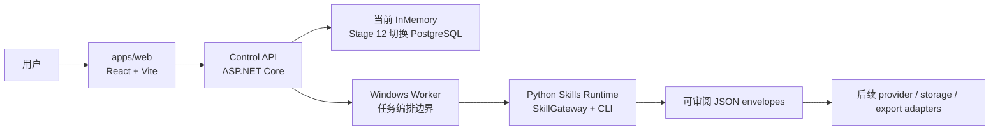
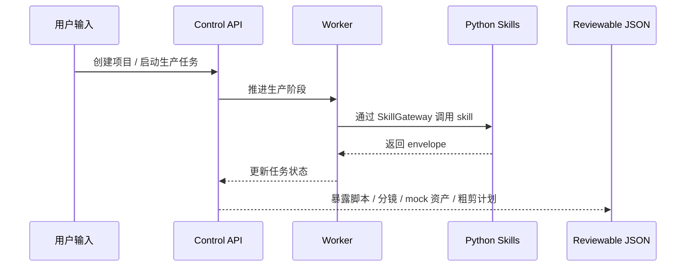

# MiLuStudio

MiLuStudio 是一个 Windows 原生 AI 漫剧生产 Agent 项目。项目面向普通创作者，目标是让用户输入中文故事、小说片段或创作要求后，通过可审阅的生产链路生成脚本、角色设定、画风、分镜、图片提示词、mock 图片资产、视频提示词、mock 视频片段、配音任务、SRT-ready 字幕、粗剪计划、质量报告和最终导出包。

当前仓库采用前后端、Worker、Python Production Skills 和后续桌面端分离的工程结构。桌面端不会绑定前后端和数据库，只有在 Web UI、Control API、Worker、PostgreSQL adapter 和核心生产功能相对稳定后，才作为独立交付壳接入。

> 说明：当前项目处于 MVP 工程搭建阶段。Stage 0 到 Stage 10 已完成，真实模型 provider、真实图片 / 视频 / 音频生成、FFmpeg 成片、PostgreSQL 持久化和桌面安装包尚未接入。现有 Skills 只输出可审阅 JSON envelope，不生成真实媒体文件。

## 项目功能

- 对中文故事或小说片段做结构化解析。
- 生成短剧改编大纲、集脚本、旁白、对白和字幕候选。
- 生成角色设定、角色音色规划和画风规则。
- 生成可审阅分镜，包含镜头时长、画面描述、角色和镜头语言。
- 生成图像提示词和 mock 图片资产结构。
- 生成视频提示词和 mock 视频片段结构。
- 生成配音任务、SRT-ready 字幕结构和粗剪 timeline / render plan。
- 通过 Control API 暴露项目、生产任务、暂停、恢复、重试、checkpoint 和 SSE 进度边界。
- 为后续 PostgreSQL 持久化、质量检查、真实 provider adapter 和桌面安装包预留清晰边界。

## 技术栈

| 模块 | 技术 |
| --- | --- |
| 前端 | React、Vite、TypeScript、CSS、lucide-react |
| Control API | .NET 8、ASP.NET Core、Minimal API |
| 应用层 | ProjectService、ProductionJobService、TaskQueueService |
| Worker | .NET BackgroundService 边界 |
| 当前存储 | InMemoryControlPlaneStore |
| 计划存储 | PostgreSQL、EF Core DbContext、Npgsql |
| Production Skills | Python、统一 CLI、SkillGateway、JSON envelope |
| 计划桌面端 | Electron、electron-builder、NSIS assisted installer |
| 开发环境 | Windows、PowerShell、D 盘封闭依赖和缓存 |

## 系统架构



架构原则：

- UI 只通过 Control API 和 DTO 通信。
- UI 不直接访问数据库、文件系统、Python 脚本、模型 SDK 或 FFmpeg。
- Python Skills 只负责内部生产能力，输入 JSON，输出 JSON envelope。
- 数据库属于后端基础设施，先在 Control API / Worker / Infrastructure 内完成。
- Electron 只做桌面宿主、安装器和本地进程管理，不定义数据库表，不执行 migrations。

## 目录结构

```text
MiLuStudio/
├── apps/
│   └── web/                         # React + Vite 前端壳
├── backend/
│   ├── control-plane/               # .NET API / Application / Domain / Infrastructure / Worker
│   └── sidecars/
│       └── python-skills/           # Python Production Skills Runtime
├── docs/                            # 总控规划、阶段计划、任务记录、交接记录
├── scripts/
│   └── windows/                     # Windows / D 盘环境约束脚本
├── README.md
└── .gitignore
```

## 核心生产链路

当前 Stage 10 已打通以下 deterministic envelope 链路：

```text
story_intake
  -> plot_adaptation
  -> episode_writer
  -> character_bible
  -> style_bible
  -> storyboard_director
  -> image_prompt_builder
  -> image_generation
  -> video_prompt_builder
  -> video_generation
  -> voice_casting
  -> subtitle_generator
  -> auto_editor
```



## 数据库与持久化说明

当前运行时仍使用内存仓库：

- `InMemoryControlPlaneStore`
- 内置 demo 项目和 demo 任务状态
- API 或 Worker 重启后状态会回到 seed 数据

PostgreSQL 是计划中的业务事实来源。仓库中已经有初版 SQL migration：

```text
backend/control-plane/db/migrations/001_initial_control_plane.sql
```

Stage 12 会单独收敛数据库能力：

- PostgreSQL / EF Core DbContext adapter。
- `RepositoryProvider=InMemory` / `RepositoryProvider=PostgreSQL` 配置切换。
- migration runner 或明确 migration 命令。
- API preflight 检查数据库、migration 和 storage 状态。
- Worker durable claiming，优先使用 PostgreSQL `FOR UPDATE SKIP LOCKED`。
- API / Worker 重启后的项目、任务、checkpoint、失败和成本恢复。

数据库不会藏进 Electron 安装器。桌面端后续只调用 Control API health / preflight 并展示结果。

## 当前边界

- 不接真实文本、图片、视频、音频或质检模型 provider。
- 不生成真实 PNG、MP4、WAV、SRT 或 ZIP。
- 不调用 FFmpeg。
- 不写真实数据库。
- 不让 UI 直接访问数据库、文件系统、Python 脚本、模型 SDK 或 FFmpeg。
- 不引入 Linux、Docker、Redis、Celery 作为第一版生产依赖。
- 所有依赖、缓存、日志、上传素材和生成结果必须限制在 `D:\code\MiLuStudio` 或明确的 D 盘工具目录。

## 本地运行说明

### 1. 前端

```powershell
cd D:\code\MiLuStudio\apps\web
. D:\code\MiLuStudio\scripts\windows\Set-MiLuStudioEnv.ps1
D:\soft\program\nodejs\npm.ps1 run build
D:\soft\program\nodejs\npm.ps1 run dev
```

### 2. .NET Control Plane

```powershell
. D:\code\MiLuStudio\scripts\windows\Set-MiLuStudioEnv.ps1
D:\soft\program\dotnet\dotnet.exe build D:\code\MiLuStudio\backend\control-plane\MiLuStudio.ControlPlane.sln --no-restore
```

如果本机正在运行 `MiLuStudio.Api`，默认 Debug 输出目录可能被锁定。可临时改用 D 盘输出目录验证编译：

```powershell
. D:\code\MiLuStudio\scripts\windows\Set-MiLuStudioEnv.ps1
D:\soft\program\dotnet\dotnet.exe build D:\code\MiLuStudio\backend\control-plane\MiLuStudio.ControlPlane.sln --no-restore -p:OutputPath=D:\code\MiLuStudio\.codex-tmp\control-plane-build\
```

### 3. Python Skills

```powershell
. D:\code\MiLuStudio\scripts\windows\Set-MiLuStudioEnv.ps1
cd D:\code\MiLuStudio\backend\sidecars\python-skills
& $env:MILUSTUDIO_PYTHON -m compileall -q milu_studio_skills skills tests
& $env:MILUSTUDIO_PYTHON -m unittest discover -s tests -v
```

运行一个 Stage 10 skill 示例：

```powershell
cd D:\code\MiLuStudio\backend\sidecars\python-skills
& $env:MILUSTUDIO_PYTHON -m milu_studio_skills run --skill auto_editor --input skills\auto_editor\examples\input.json --output skills\auto_editor\examples\output.json --pretty
```

## 项目亮点

- 不是单一 demo 页面，而是按真实 AI 漫剧生产链路拆分脚本、角色、风格、分镜、图片、视频、配音、字幕和剪辑边界。
- 使用统一 Python Skills Runtime 和 `SkillGateway`，让内部 Production Skills 可测试、可审阅、可替换。
- 每个阶段都输出结构化 JSON envelope，便于后续写入数据库、展示审核卡片、记录成本和重试。
- Control API / Worker / Python Sidecar 分层清晰，UI 不直接碰底层系统能力。
- 数据库和桌面端明确解耦，避免 Electron 安装器过早绑定业务持久化。
- 所有阶段都强调 Windows 原生交付、D 盘环境约束和商业授权边界。
- 对真实 provider、FFmpeg、PostgreSQL、桌面安装器和账号授权都保留 adapter 边界，方便后续逐步接入。

## 文档导航

- [总构建计划](./docs/MILUSTUDIO_BUILD_PLAN.md)
- [阶段计划](./docs/MILUSTUDIO_PHASE_PLAN.md)
- [任务记录](./docs/MILUSTUDIO_TASK_RECORD.md)
- [短棒交接](./docs/MILUSTUDIO_HANDOFF.md)
- [产品规格](./docs/PRODUCT_SPEC.md)
- [参考项目说明](./docs/REFERENCE_PROJECTS.md)

## 后续可改进方向

- 实现 Stage 11 `quality_checker`，输出质量问题报告、严重级别和可自动重试项。
- 实现 Stage 12 PostgreSQL adapter、EF Core DbContext、migration runner、preflight 和 Worker durable claiming。
- 将 Stage 5-11 的 skill 输出持久化到 `generation_tasks`、`assets` 和 `cost_ledger`。
- 接入真实 Text / Image / Video / Audio / Edit provider adapter。
- 在 Web UI 中补齐脚本卡、角色卡、分镜卡、资产卡、质量报告和导出区。
- 在核心前后端稳定后实现 Stage 13 Electron + electron-builder + NSIS 桌面安装包。
- 在桌面 MVP 后推进账号注册、登录、设备绑定和许可证授权系统。
