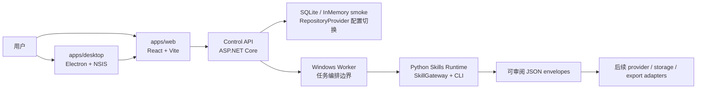
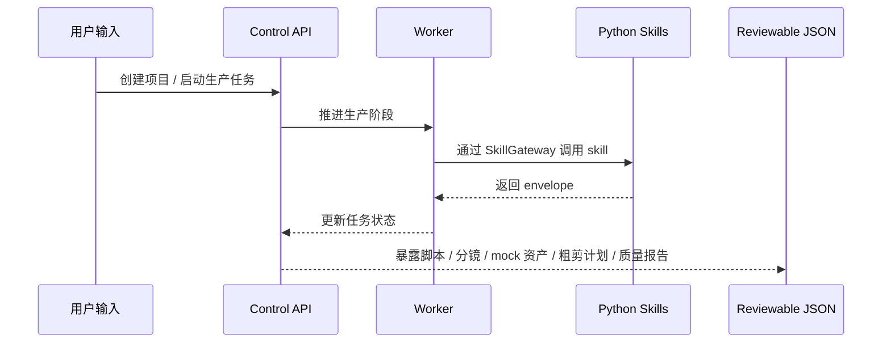

# MiLuStudio

MiLuStudio 是一个 Windows 原生 AI 漫剧生产 Agent 项目。项目面向普通创作者，目标是让用户输入中文故事、小说片段或创作要求后，通过可审阅的生产链路生成脚本、角色设定、画风、分镜、图片提示词、mock 图片资产、视频提示词、mock 视频片段、配音任务、SRT-ready 字幕、粗剪计划、质量报告和最终导出包。

当前仓库采用前后端、Worker、Python Production Skills 和桌面端分离的工程结构。Stage 15 已把 Electron 桌面宿主作为独立交付壳接入：桌面端只负责承载 Web UI、启动本地 Control API / Worker、注入 Control API base URL、展示 preflight 和生成 Windows 安装包，不绑定数据库 schema、migration 或业务文件系统。Stage 16 已补齐本地 deterministic 账号注册、登录、会话和设备绑定；许可证、激活码和付费码相关体验已从当前网页端与桌面端撤下，作为后续商业化大后期内容保留边界。Stage 17 已完成生产控制台可编辑能力。Stage 18 已完成真实 provider adapter 前配置页。Stage 19 已完成桌面发布验收与代码签名前置准备。Stage 20 已把 Web 主入口重构为 Codex 式工作台：左侧历史项目、中央单输入框、右侧进度与结果预览卡、阶段门禁加号上传菜单，以及左下角统一设置入口。Stage 21 已完成新工作台结构化产物编辑增强。Stage 22 已完成 provider adapter 安全前置层。Stage 23A 已推进 OpenAI-compatible baseUrl + API key 配置、DPAPI 本地密钥、连接测试、项目内 FFmpeg runtime 安装脚本、真实上传资产保存、文本 / DOCX / 图片 / 视频技术解析和审核回退。Stage 23B 已正式确认为文档 / 媒体深度解析与上传策略加固阶段，并已完成稳定 metadata / 文本切片 / PDF 嵌入文本探测 / DOC 结构化降级 / 媒体派生策略、后端可恢复分片上传 session API，以及 asset analysis 解析详情消费接口。2026-05-15 已完成 Stage 23B-P0 SQLite 本地持久化与开发稳定化补丁：当前项目数据库全面转向 SQLite，不再保留旧外部数据库路线；Stage 23B-P1 已确认截图中的 Web 未连接问题来自浏览器 Web dev 未编排 5368 Control API，不是 SQLite 后端启动失败；Stage 23B-P2 已完成旧数据库残留清理、旧 runtime / 输出清理、Desktop runtime 重新生成、Web dev 本地服务启动编排和 Control API 不可达提示；Stage 23B-P3 已完成设置入口收口：主侧栏不再保留模型入口，左下设置菜单中的“模型”下方新增“依赖”，通过 Control API 展示 SQLite、storage、uploads、FFmpeg、OCR、Python runtime 和 skills root 状态；Stage 23B-P4 已完成工作台 UI 视觉轻量化补丁，收敛设置菜单、历史项目、开始生成按钮、模型配置、依赖和诊断面板的文本 / 边框 / 卡片重量；Stage 23B-P5 已完成品牌栏、composer 输入区和真实上传文件大小提示收尾；Stage 23B-P6 已完成右侧进度卡状态去重、左侧项目栏拖拽宽度和完全收缩 / 展开补丁。下一步进入正式 Stage 23C，继续 OCR runtime 固化、PDF rasterizer、DOC/PDF 深度解析、工作台详情和生产链路消费任务。

> 说明：当前项目处于 MVP 工程搭建阶段。Stage 0 到 Stage 22 已完成，Stage 23A 已推进真实上传、基础解析、FFmpeg 缩略图 / 抽帧和审核回退，Stage 23B 已开始落地上传后处理地基：`assets.metadata_json` 记录 `stage23b_asset_analysis_v1`、文本 / DOCX / PDF 可生成 chunk manifest、PDF 可做轻量嵌入文本探测、DOC 缺少 converter runtime 时返回结构化降级 metadata，图片 OCR 已接入后端 Tesseract-compatible CLI 调用路径，runtime 可用时会产出 OCR 文本和 chunk manifest，缺少 runtime 时返回 `runtime_not_configured`；图片 / 视频由后端 adapter 记录压缩、缩略图、抽帧和 review proxy 派生策略；后端已新增 `upload-sessions` 可恢复分片上传 API，chunk 临时文件只落在项目 `uploads\.upload-sessions` 内，complete 后复用现有 assets 登记与解析链路；后端也已新增 `GET /api/projects/{projectId}/assets/{assetId}/analysis`，让工作台详情或后续生产链路通过 Control API 消费 parser / OCR summary / content blocks / chunk manifest，而不是读取本地文件路径。Stage 23B-P2 已把浏览器 Web dev 入口补齐为可选 `npm run dev:local`，会先启动本地 Control API / Worker，再启动 Vite；单独启动 Vite 时也会显示明确的 Control API 不可达页面。当前已可通过 Electron + electron-builder + NSIS 生成 Windows 桌面安装包，在应用内通过 Control API 完成登录、注册、会话和设备绑定，并在 Codex 式工作台中上传解析文本 / 图片 / 视频附件、提交制作要求、跟踪生产进度、预览结果、编辑真实分镜产物，以及编辑角色 / 画风 / 图片提示词 / 视频提示词结构化产物。Web 已有 OpenAI-compatible provider 配置和连接测试；桌面发布验收脚本会识别当前安装器和主程序仍为 `NotSigned`；真实模型 provider 生成、PDF 扫描页 OCR rasterizer、真实图片 / 视频 / 音频生成、真实媒体质检和最终成片尚未接入。
> 安装包路线补充：第一版产品不依赖公司公网服务器作为基础体验前提。安装包应尽量自带可控 runtime；无法或不适合随包携带的大文件，改为设置中的“依赖中心”检测、修复、启用和导入离线包。在线下载只能作为可选辅助路径，不作为干净机器可用性的唯一方案。

## 项目功能

- 对中文故事或小说片段做结构化解析。
- 生成短剧改编大纲、集脚本、旁白、对白和字幕候选。
- 生成角色设定、角色音色规划和画风规则。
- 生成可审阅分镜，包含影片概览、分部信息、镜头时长、环境描写、时间切片、景别、运镜、音效和背景音乐等中文分镜稿字段。
- 生成图像提示词和 mock 图片资产结构。
- 生成视频提示词和 mock 视频片段结构。
- 生成配音任务、SRT-ready 字幕结构和粗剪 timeline / render plan。
- 生成质量问题报告、严重级别、可自动重试项和人工确认 checkpoint。
- 通过 Control API 暴露项目、生产任务、暂停、恢复、重试、checkpoint 和 SSE 进度边界。
- 生产控制台点击开始生成或重新生成时，会先保存当前输入，再淘汰同项目未完成旧 job 并创建新 job，确保 Worker 消费的是当前剧本内容。
- 生产控制台已把内部 skill / stage / status 默认转成中文业务文案，并为 checkpoint 补“本步产出、检查项、通过后、拒绝后”和真实产物预览。
- `storyboard_director` 仍保留下游可消费的 `shots` JSON，同时新增 `film_overview`、`storyboard_parts`、`rendered_markdown` 和 `validation_report`，先对齐专业分镜 MD 的展示结构。
- 生产控制台分镜结果卡已支持编辑镜头时长、场景、画面动作、景别、镜头运动、声音、对白和旁白；保存或单镜头重算都只通过 Control API 写回 `storyboard_director` envelope，并重置下游任务等待审核后重算。
- Web 主入口已重构为 Codex 式工作台：左侧展示历史项目，项目栏支持桌面 / 移动端拖拽宽度和 Codex 式完全收缩 / 左上边缘展开；中央新项目默认只有一个制作要求输入框；左下角加号上传菜单按当前生产阶段启用文本 / 图片 / 视频入口，附件通过 Control API 上传到项目资产并做技术解析；Stage 23B-P5 起新项目必须先添加故事文本附件才启用生成，composer 不再显示或执行旧 500-2000 字输入限制，上传菜单改为展示真实文件大小上限；右侧显示当前进度、确认 / 回退状态、结果预览和打开入口。
- Stage 23B 第一轮上传解析 metadata 已落地：文本 / DOCX / PDF 解析结果会写入 content blocks 与 chunk manifest；DOC / OCR 不可用时返回结构化降级；图片生成 1280px review preview，视频生成抽帧 metadata 和短 review proxy，均只由后端 adapter 执行。
- Stage 23B 后端可恢复分片上传 API 已落地：创建 session、乱序上传 chunk、查询 resume 状态和 complete 合并，最终仍进入同一个 Control API 上传解析链路。
- Stage 23B asset analysis 消费接口已落地：`GET /api/projects/{projectId}/assets/{assetId}/analysis` 只读取数据库中的 `metadata_json`，返回 parser、OCR summary、content blocks、chunk manifest、上传策略和 no-provider 边界，并避免把本地 `uploads/storage` 路径作为 UI 可消费契约。
- 桌面诊断、模型配置、依赖和账户退出已统一收束到左下角设置入口；前端仍只通过 Control API client 访问项目、任务、provider settings、依赖检测、诊断和分镜编辑 API。
- “模型”设置页已接入 OpenAI-compatible 中转配置：Text / Image / Video / Audio / Edit adapter 的供应商、默认模型、Base URL、启用开关、DPAPI 本地 API Key、安全状态、单项目成本上限、失败重试次数、本地 preflight 和连接测试。
- Stage 19 已新增桌面发布验收脚本，覆盖安装包、`win-unpacked`、运行时资源、快捷方式 / 自启动脚本、Electron 安全边界、签名状态和桌面模式 Control API 边界。
- 已通过 Control API 管理账号、会话和设备绑定，网页端与桌面端当前不展示许可证或激活码流程。
- 已确认数据库路线全面转向 SQLite 本地文件数据库；媒体文件、派生文件、本地模型和缓存仍留在后端管理的文件目录，数据库只保存项目、账号、任务、资产索引、配置指纹、审计和状态。
- 中文测试剧本 fixture 已放在 `docs\test-fixtures\scripts`，包含 Project Gutenberg《牡丹亭》完整文本和历史 500 字 smoke 测试样本；当前工作台新项目优先通过上传文本 / DOCX / DOC / PDF 附件进入解析链路。

## 技术栈

| 模块 | 技术 |
| --- | --- |
| 前端 | React、Vite、TypeScript、CSS、lucide-react |
| Control API | .NET 8、ASP.NET Core、Minimal API |
| 应用层 | ProjectService、ProductionJobService、TaskQueueService、AuthLicensingService |
| Worker | .NET BackgroundService 边界 |
| 当前存储 | SQLite 本地文件数据库，InMemoryControlPlaneStore 仅作为快速 smoke 备选 |
| SQLite | EF Core SQLite DbContext、本地 `.sqlite` 数据文件、后端 migration / preflight |
| Production Skills | Python、统一 CLI、SkillGateway、JSON envelope |
| 桌面端 | Electron、electron-builder、NSIS assisted installer、自定义 `installer.nsh` |
| 依赖中心 | 设置页通过 Control API 检测 runtime 状态；修复、启用和导入离线包后续补齐，在线下载只作辅助 |
| 开发环境 | Windows、PowerShell、D 盘封闭依赖和缓存 |

## 系统架构



架构原则：

- UI 只通过 Control API 和 DTO 通信。
- UI 不直接访问数据库、文件系统、Python 脚本、模型 SDK 或 FFmpeg。
- Python Skills 只负责内部生产能力，输入 JSON，输出 JSON envelope。
- 数据库属于后端基础设施，先在 Control API / Worker / Infrastructure 内完成。
- Electron 只做桌面宿主、安装器和本地进程管理，不定义数据库表，不执行 migrations。

## 目录结构

```text
MiLuStudio/
├── apps/
│   ├── web/                         # React + Vite 前端壳
│   └── desktop/                     # Electron 桌面宿主和 NSIS 打包配置
├── backend/
│   ├── control-plane/               # .NET API / Application / Domain / Infrastructure / Worker
│   └── sidecars/
│       └── python-skills/           # Python Production Skills Runtime
├── docs/                            # 总控规划、阶段计划、任务记录、交接记录
├── scripts/
│   └── windows/                     # Windows / D 盘环境约束脚本
├── README.md
└── .gitignore
```

## 核心生产链路

当前 Python Skills 已打通以下 deterministic envelope 链路，Stage 12 已为这些输出补齐后端持久化写回边界：

```text
story_intake
  -> plot_adaptation
  -> episode_writer
  -> character_bible
  -> style_bible
  -> storyboard_director
  -> image_prompt_builder
  -> image_generation
  -> video_prompt_builder
  -> video_generation
  -> voice_casting
  -> subtitle_generator
  -> auto_editor
  -> quality_checker
  -> export_packager
```



## 数据库与持久化说明

Stage 23B-P0 已确认把当前项目数据库全面转向 SQLite：

- 目标数据库：SQLite 本地文件数据库。
- 目标开发路径：`D:\code\MiLuStudio\storage\milu-control-plane.sqlite3` 或由 `ControlPlane` 配置显式指定的 D 盘路径。
- 目标桌面路径：由后端 Control API 在桌面数据目录下管理，Electron 只展示 health / preflight，不直接打开数据库文件。
- 目标 provider：`RepositoryProvider=SQLite`；`InMemory` 仅保留给快速 smoke / 临时测试。
- 旧外部数据库路线不再作为后续产品路线保留；旧 SQL migration 和专门配置说明已在 Stage 23B-P2 删除，必要历史背景只保留在任务记录 / 归档上下文中，运行时实现已移除旧 provider 和初始化脚本。

SQLite 承载边界：

- 适合保存项目、故事输入、账号、会话、设备、任务状态、generation task output、资产索引、成本 / 审计流水、provider 配置指纹和本地依赖状态。
- 图片、视频、音频、字幕、最终导出、缩略图、抽帧、OCR 中间文件、本地大模型权重和模型缓存不写入 SQLite，只由后端 adapter 管理文件路径、hash、大小、格式、派生关系和状态。
- 后续如接本地大模型，数据库只记录模型配置、启用状态、任务请求、成本估算、日志和产物索引；模型权重、KV cache、向量缓存或生成媒体仍落文件目录，不让数据库承担大文件吞吐。
- 手机号 / 邮箱真实校验、密码找回和重置会增加账号表和审计表访问，但对单机安装包型产品仍属于 SQLite 能稳定承载的轻量事务范围。

迁移补丁范围：

1. 将默认配置、preflight、migration service、repository provider 和验证脚本切换到 SQLite。
2. 把 JSON envelope 字段收敛为 SQLite `TEXT` 存储，Application 层继续使用 JSON envelope 字符串读写。
3. 将 Worker durable claiming 改为 SQLite 可控事务 / 乐观更新领取策略。
4. 收窄阶段验证脚本的进程清理规则，避免临时测试误杀正在 5368 端口运行的开发后端。

数据库仍不藏进 Electron 安装器。SQLite 文件、schema 初始化和 migration 由 Control API / Infrastructure 后端边界负责，桌面端不定义表、不执行 migration、不负责数据库初始化。

## 打包前补丁

Stage 14 已完成，且未创建 Electron / 安装器。它把 Stage 13 之后发现的打包前问题先修掉：

- 让 Web UI 中用户输入或修改的故事、标题、模式、时长、画幅和风格真正保存到 Control API / 后端持久化层。
- 统一 Control API 默认端口、CORS、API base URL 和后续桌面宿主的配置注入方式。
- 清理过期 mock 文案和无实际处理器按钮，补齐 checkpoint 基本确认语义。
- 当时加固默认 provider、InMemory 显式启用、skill run 临时目录清理和契约漂移检查；Stage 23B-P0 已把默认持久化路线替换为 SQLite。
- 补 API / Worker 自动化集成 PowerShell 脚本：`scripts\windows\Test-MiLuStudioStage14Integration.ps1`；Stage 23B-P0 后已改为 SQLite 集成验证。
- 补 Python skill registry / `skill.yaml` / schema / validator 契约漂移检查：`backend\sidecars\python-skills\tests\test_stage14_skill_contracts.py`。

## 桌面打包

Stage 15 已完成 Electron + electron-builder + NSIS assisted installer：

- 新增 `apps\desktop`，通过本地 HTTP host 承载 `apps\web` 构建产物，避免 `file://` 路由和资源问题。
- 桌面宿主随机绑定本地端口，启动发布后的 Control API 和 Windows Worker，并通过 preload 注入 `window.__MILUSTUDIO_CONTROL_API_BASE__`；写请求额外携带桌面会话令牌，防止其他本地页面直接复用桌面 API。
- Web UI 已新增桌面诊断面板，调用 Electron IPC 获取 Control API health / preflight、数据库、storage、Python runtime、Python skills root、Worker 和 Web host 状态。
- 打包图标、安装器图标、卸载器图标、header 图标和托盘图标均由 `apps\web\public\brand\logo.png` 生成的 `apps\desktop\build\icon.ico` 提供。
- 桌面 runtime 默认打包 self-contained .NET API / Worker 与 `resources\python-runtime\python.exe`，干净 Windows 机器不再依赖外部 `dotnet.exe` 或本机 Python 安装。
- 安装包方向以“尽量自带可控 runtime”为主：.NET API / Worker、Python runtime、已验证 FFmpeg / OCR / 文档解析 runtime 优先随包或随离线依赖包交付；设置页后续新增依赖中心，负责检测、修复、启用和导入离线包，在线下载只作为辅助修复方式。
- Electron `userData`、`sessionData` 和 logs 已显式指向 D 盘数据目录，避免默认落到 `C:\Users\...\AppData\Roaming`。
- Electron 主进程已限制外部导航、弹窗和 IPC 来源；Control API 桌面模式只允许桌面 Web host origin，并禁止桌面宿主执行 migration apply。
- electron-builder 输出 `D:\code\MiLuStudio\outputs\desktop\MiLuStudio-Setup-0.1.0.exe`，并保留 `win-unpacked` 供本地 smoke 验证。
- 自定义 `apps\desktop\build\installer.nsh` 当前只保留桌面快捷方式、开始菜单快捷方式和开机自启动复选项；安装前激活码页已撤下。
- Stage 19 新增 `scripts\windows\Test-MiLuStudioStage19DesktopRelease.ps1` 和 `docs\MILUSTUDIO_STAGE19_DESKTOP_RELEASE_CHECKLIST.md`，可重打包并验收安装器、运行时资源、签名前置配置和桌面 API 安全边界。
- 当前本机安装器和 `win-unpacked\MiLuStudio.exe` 的 Authenticode 状态仍为 `NotSigned`；本地验收允许记录为阻塞项，正式发布必须使用 `-RequireSigned` 阻断未签名产物。

## 账号与登录

Stage 16 已完成应用内账号注册、登录、会话和设备绑定：

- 新增 `AuthLicensingService`、`IAuthRepository`、token / password service 和账号会话链路。
- 当前 Control API：`/api/auth/register`、`/api/auth/login`、`/api/auth/refresh`、`/api/auth/logout`、`/api/auth/me`、`/api/auth/devices/bind`。
- Web UI 默认先展示登录 / 注册入口；登录后直接进入项目列表、项目详情和生产控制台。
- 项目、生产任务和 generation task 写回类 API 已加最小登录门禁；未登录返回 401。
- Electron 仍只注入 Control API base URL 和桌面会话令牌；账号密码和设备绑定都不放进 Electron 或安装器脚本。
- 许可证、激活码和付费码相关能力不作为当前 MVP 体验，后续商业化阶段再重新设计。

## Provider 前配置

Stage 18-23A 已完成真实 provider adapter 前配置页和连接测试前置：

- Web 左上“模型”入口已撤下；左下设置菜单中的“模型”打开 provider 设置，仍只通过 Control API 读取、保存和测试配置。
- Control API 提供 `GET /api/settings/providers`、`PATCH /api/settings/providers`、`GET /api/settings/providers/preflight`、`GET /api/settings/providers/safety`、`POST /api/settings/providers/spend-guard/check` 和 `POST /api/settings/providers/{kind}/connection-test`。
- Application 层新增 `ProviderSettingsService`，Infrastructure 层新增本地文件 repository；该能力不走 Electron，不新增数据库 migration。
- 支持 Text / Image / Video / Audio / Edit 五类 adapter 的供应商、默认模型、Base URL、启用状态、API Key、安全状态、单项目成本上限和失败重试次数。
- API Key 请求体会被处理成遮罩和 SHA256 指纹；Windows 本机使用 DPAPI 保存可用于连接测试的本地加密 secret material，响应永不回显明文 key。
- provider connection test 只访问 OpenAI-compatible `/models` 探测端点，不发送真实生成 payload。
- Stage 23A 仍阻断真实 provider 生成调用；后续接入真实生成前必须补审计、预算、超时、失败隔离和 dry-run 契约。

## 桌面发布验收

Stage 19 已完成桌面发布验收与代码签名前置准备：

- `apps\desktop\package.json` 新增 `verify:release` 和 `verify:release:signed`。
- `scripts\windows\Test-MiLuStudioStage19DesktopRelease.ps1` 可检查 package 配置、安装器产物、`win-unpacked`、Web dist、Control API / Worker runtime、Python runtime、Python Skills、最新 migration、Electron 安全设置、安装器快捷方式 / 自启动选项和 Authenticode 状态。
- 桌面本地 Web host 已设置 CSP 与 `X-Content-Type-Options: nosniff`；Stage 19 脚本会检查脚本来源、loopback 连接、object/base/form/frame 限制。
- 脚本默认允许 `NotSigned` 并写入警告；带 `-RequireSigned` 时安装器和主 exe 必须是 `Valid`。
- `.gitignore` 已忽略 `*.pfx`、`*.p12`、`*.pvk`、`*.spc` 和 `*.key`，避免代码签名证书或私钥容器进入仓库。
- 干净 Windows 手工验收步骤记录在 [Stage 19 桌面发布验收清单](./docs/MILUSTUDIO_STAGE19_DESKTOP_RELEASE_CHECKLIST.md)。

## Web 工作台

Stage 20-23A 已完成 Codex 式前端工作台重构和上传 / 审核增强：

- `apps\web\src\features\workspace\StudioWorkspacePage.tsx` 作为登录后的主入口，替代旧多导航壳。
- 左侧栏顶部展示“麋鹿”品牌栏，logo 位于名称左侧；其下显示项目区，项目标题右侧保留“搜索”和“新项目”图标按钮，历史项目列表和左下角设置菜单维持固定位置；Stage 23B-P6 起项目栏可拖拽调整宽度并支持完全收缩，展开按钮固定在左上边缘。
- 新项目空态中央只显示一个制作要求输入框；故事正文优先通过加号上传文本 / DOCX / DOC / PDF 等附件进入 Control API 上传解析链路，未添加故事文本附件时新项目生成按钮保持禁用。
- Stage 23B-P5 已移除当前工作台 composer 的旧字数计数、500-2000 字提交拦截和自动截断；文本 / 图片 / 视频上传菜单展示当前真实文件大小限制：文本 50 MB、图片 50 MB、视频 1 GB。
- 启动生产前仍先通过 Control API 保存项目输入，再创建 production job，并通过 SSE 更新右侧进度卡。
- 右侧结果区只展示真实 generation task output 和 project assets；打开分镜结果后可继续通过 Control API 保存分镜表或按单镜头备注重算。
- 打开角色、画风、图片提示词或视频提示词结果后，可在工作台内编辑结构化字段；保存时通过 `PATCH /api/generation-tasks/{taskId}/structured-output` 写回 JSON envelope，并重置下游任务等待重新计算。
- 当前审核步骤可在右侧流程中确认；最近一个已确认审核步骤 hover 显示“回退”，二次确认后通过 `POST /api/production-jobs/{jobId}/rollback` 回到待审核并清空下游任务输出。
- 桌面诊断、模型配置、依赖和账户信息统一从左下角设置菜单打开，不让 Web 或 Electron 绕过 Control API / Worker 边界。

## 当前边界

- 仍不接真实文本、图片、视频、音频或质检模型生成 provider；当前只允许 OpenAI-compatible 连接测试。
- 已允许真实上传文件、技术解析、FFmpeg 缩略图 / 抽帧派生文件和本地中间文件，但必须通过 Control API / Application service / Infrastructure adapter 边界执行。
- 当前不生成最终真实 MP4 / WAV / SRT / ZIP，不提供成片下载；真实字幕、音频、视频导出仍在后续阶段。
- Stage 23A 只落地 provider 连接测试、项目内 FFmpeg runtime 安装脚本、真实上传 / 技术解析和审核回退；真实 provider 生成、商业授权、激活码和付费码后置。
- Stage 23B 正式范围是文档 / 媒体深度解析与上传策略加固；已完成稳定 metadata schema、文本切片 manifest、PDF 嵌入文本探测、DOC 结构化降级、图片 OCR runtime 调用路径、图片 preview、视频抽帧 / review proxy、可恢复分片上传 endpoint、asset analysis 消费接口和验证脚本；当前本机仍未安装可控 Tesseract runtime，PDF 扫描页 rasterizer、更深 DOC/PDF 解析、工作台详情展示与生产链路实际接入仍后续推进。
- Stage 23B-P0 已完成 SQLite 本地持久化补丁；默认开发和桌面模式都使用 SQLite，InMemory provider 只保留为快速 smoke / 特殊轻量场景。
- Stage 23B-P0 同时确立安装包依赖策略：基础 runtime 尽量随包或离线包交付，设置依赖中心负责检测、修复、启用和导入离线包，不把在线下载作为唯一可用路径。
- Stage 23B-P2 已完成 SQLite 迁移后的稳定化收尾：旧 SQL migration / setup 文档已删除，Python skill 示例改为 SQLite / 后端边界口径，Desktop runtime 已重新生成，Web dev 可用 `npm run dev:local` 自动编排本地 Control API / Worker。
- Stage 23B-P3 已完成设置入口收尾：左侧主栏移除遗留“模型”入口，左下设置菜单新增“依赖”入口并消费 `/api/system/dependencies`，后续修复动作、离线包导入和启用 / 禁用仍只允许通过 Control API / 后端 adapter 补齐。
- Stage 23B-P3 后续完成左侧栏 UI 收口：诊断入口归入设置二级菜单第一项，左侧栏顶部展示“麋鹿”品牌栏，其下显示项目区；项目标题右侧从右往左为“新项目”和“搜索”图标按钮。
- Stage 23B-P4 已完成工作台 UI 视觉轻量化：设置菜单、历史项目条目、开始生成按钮、设置弹窗、模型配置、依赖和诊断面板统一降低字重、边框、圆角和卡片填充重量，右侧进度卡片现有节奏保持不变。
- Stage 23B-P5 已完成 composer 与品牌栏细节收尾：缩小并弱化左侧“麋鹿”logo / 字样，制作要求输入区加高到多行输入形态，生成按钮改为 composer 专用轻按钮，上传菜单只展示真实文件大小限制而不新增文本字数硬限制。
- Stage 23B-P6 已完成侧栏与进度卡补丁：右侧进度摘要只保留完成计数，阶段状态只在流程项右侧展示；左侧项目栏支持拖拽宽度、持久化宽度、完全收缩和左上边缘展开。
- 不让 UI 直接访问数据库、文件系统、Python 脚本、模型 SDK 或 FFmpeg。
- 不引入 Linux、Docker、Redis、Celery 作为第一版生产依赖。
- 所有依赖、缓存、日志、上传素材和生成结果必须限制在 `D:\code\MiLuStudio` 或明确的 D 盘工具目录。

## 下一阶段

Stage 23B 已正式确认并开始落地。Stage 23B-P0 SQLite 本地持久化与开发稳定化补丁已完成；Stage 23B-P1 已完成检查与切分判断；Stage 23B-P2 已完成稳定化收尾；Stage 23B-P3 已完成设置入口和依赖入口补丁；Stage 23B-P4 已完成工作台 UI 视觉轻量化补丁；Stage 23B-P5 已完成品牌栏、composer 输入区和真实上传大小提示收尾；Stage 23B-P6 已完成进度卡去重和侧栏拖拽 / 收缩补丁。`Stage 23B-*P` 均为补丁阶段，下一步回到正式功能阶段：

1. Stage 23C：安装 / 固化 Tesseract-compatible OCR runtime、PDF 扫描页 rasterizer、DOC/PDF 更深解析、工作台详情展示 / 生产链路实际消费和媒体派生策略回归。
2. Stage 23D：provider adapter 真实接入前 dry-run / audit contract，只做接口契约、审计日志、预算流水和失败隔离，不发真实生成请求。
3. Stage 24：工作台高级编辑，包括提示词批量操作、镜头增删、更细粒度 diff 和重算策略。
4. 发布回归阶段：拿到正式证书后做 `verify:release:signed`、干净 Windows 虚拟机安装 / 卸载回归和发布说明。

商业授权、激活码、付费码和套餐计费体系暂不作为近期 MVP 范围。

## 本地运行说明

### 1. 前端

```powershell
cd D:\code\MiLuStudio\apps\web
. D:\code\MiLuStudio\scripts\windows\Set-MiLuStudioEnv.ps1
D:\soft\program\nodejs\npm.ps1 run build
D:\soft\program\nodejs\npm.ps1 run dev:local
```

说明：`dev:local` 会先通过 `scripts\windows\Start-MiLuStudioLocalServices.ps1` 启动 5368 Control API 与 Worker，再启动 Vite。只需要后端服务时可运行 `D:\soft\program\nodejs\npm.ps1 run services:start`，结束后运行 `D:\soft\program\nodejs\npm.ps1 run services:stop`；单独运行 `npm run dev` 仍只启动 Vite，页面会显示明确的本地服务未连接提示。

### 2. .NET Control Plane

```powershell
. D:\code\MiLuStudio\scripts\windows\Set-MiLuStudioEnv.ps1
D:\soft\program\dotnet\dotnet.exe build D:\code\MiLuStudio\backend\control-plane\MiLuStudio.ControlPlane.sln
```

如果本机正在运行 `MiLuStudio.Api`，默认 Debug 输出目录可能被锁定。可临时改用 D 盘输出目录验证编译：

```powershell
. D:\code\MiLuStudio\scripts\windows\Set-MiLuStudioEnv.ps1
D:\soft\program\dotnet\dotnet.exe build D:\code\MiLuStudio\backend\control-plane\MiLuStudio.ControlPlane.sln -p:OutputPath=D:\code\MiLuStudio\.tmp\control-plane-build\
```

### 3. Python Skills

```powershell
. D:\code\MiLuStudio\scripts\windows\Set-MiLuStudioEnv.ps1
cd D:\code\MiLuStudio\backend\sidecars\python-skills
& $env:MILUSTUDIO_PYTHON -m compileall -q milu_studio_skills skills tests
& $env:MILUSTUDIO_PYTHON -m unittest discover -s tests -v
```

运行一个 Stage 11 skill 示例：

```powershell
cd D:\code\MiLuStudio\backend\sidecars\python-skills
& $env:MILUSTUDIO_PYTHON -m milu_studio_skills run --skill export_packager --input skills\export_packager\examples\input.json --output skills\export_packager\examples\output.json --pretty
```

### 4. 桌面宿主与安装包

```powershell
cd D:\code\MiLuStudio\apps\desktop
. D:\code\MiLuStudio\scripts\windows\Set-MiLuStudioEnv.ps1
D:\soft\program\nodejs\npm.ps1 run smoke
D:\soft\program\nodejs\npm.ps1 run dist:win
D:\soft\program\nodejs\npm.ps1 run verify:release
```

也可以用脚本执行桌面验证：

```powershell
. D:\code\MiLuStudio\scripts\windows\Set-MiLuStudioEnv.ps1
D:\code\MiLuStudio\scripts\windows\Test-MiLuStudioDesktop.ps1 -SkipInstall
```

桌面模式 API 安全验证脚本：

```powershell
D:\code\MiLuStudio\scripts\windows\Test-MiLuStudioDesktopApiSecurity.ps1 -SkipPrepareRuntime
```

正式签名发布前使用：

```powershell
cd D:\code\MiLuStudio\apps\desktop
D:\soft\program\nodejs\npm.ps1 run verify:release:signed
```

Stage 16 账号与会话集成验证：

```powershell
powershell -ExecutionPolicy Bypass -File D:\code\MiLuStudio\scripts\windows\Test-MiLuStudioStage16Auth.ps1
```

Stage 17 分镜编辑闭环验证：

```powershell
powershell -ExecutionPolicy Bypass -File D:\code\MiLuStudio\scripts\windows\Test-MiLuStudioStage17StoryboardEditing.ps1
```

Stage 22 Provider 安全前置层验证：

```powershell
powershell -ExecutionPolicy Bypass -File D:\code\MiLuStudio\scripts\windows\Test-MiLuStudioStage22ProviderSafety.ps1
```

## 项目亮点

- 不是单一 demo 页面，而是按真实 AI 漫剧生产链路拆分脚本、角色、风格、分镜、图片、视频、配音、字幕、剪辑和质检边界。
- 使用统一 Python Skills Runtime 和 `SkillGateway`，让内部 Production Skills 可测试、可审阅、可替换。
- 每个阶段都输出结构化 JSON envelope，便于后续写入数据库、展示审核卡片、记录成本、定位质量问题和重试。
- Control API / Worker / Python Sidecar 分层清晰，UI 不直接碰底层系统能力。
- 数据库和桌面端明确解耦，避免 Electron 安装器过早绑定业务持久化。
- Electron 桌面宿主只通过 Control API 与业务系统通信，并可展示 health / preflight / Worker 状态。
- 所有阶段都强调 Windows 原生交付、D 盘环境约束和商业化后置边界。
- 对真实 provider、FFmpeg、SQLite 本地持久化、桌面安装器和账号体系都保留 adapter 边界，方便后续逐步接入。

## 文档导航

- [总构建计划](./docs/MILUSTUDIO_BUILD_PLAN.md)
- [阶段计划](./docs/MILUSTUDIO_PHASE_PLAN.md)
- [任务记录](./docs/MILUSTUDIO_TASK_RECORD.md)
- [短棒交接](./docs/MILUSTUDIO_HANDOFF.md)
- [产品规格](./docs/PRODUCT_SPEC.md)
- [参考项目说明](./docs/REFERENCE_PROJECTS.md)
- [Stage 19 桌面发布验收清单](./docs/MILUSTUDIO_STAGE19_DESKTOP_RELEASE_CHECKLIST.md)

## 后续可改进方向

- 接入真实媒体质量检测 adapter，例如黑屏、卡顿、水印、分辨率、音量和字幕烧录检测。
- 接入真实 Text / Image / Video / Audio / Edit provider adapter。
- 在新 Web 工作台中继续补齐脚本卡、资产卡、质量报告和导出区的编辑与 diff，并扩展角色、画风和提示词的批量操作。
- 拿到正式代码签名证书后补真实 Authenticode 签名流水线和干净 Windows 机器安装回归；Stage 19 已能用 `-RequireSigned` 阻断未签名安装包。
- 后续商业化大后期再推进许可证、付费码、套餐限制和云端授权系统。
